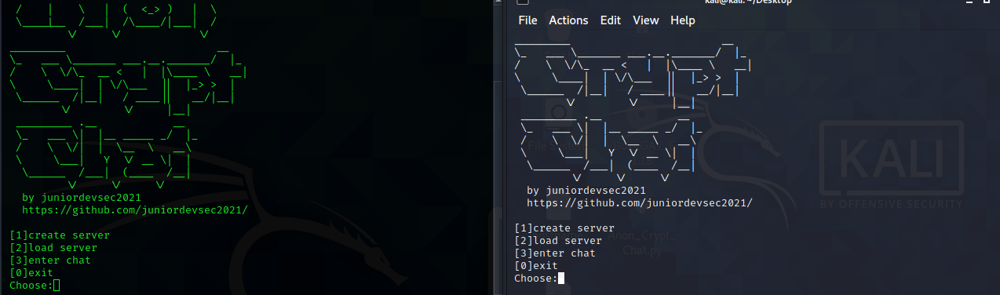
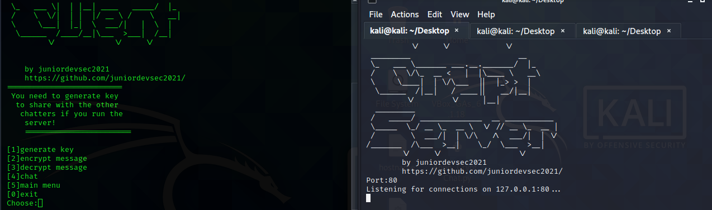
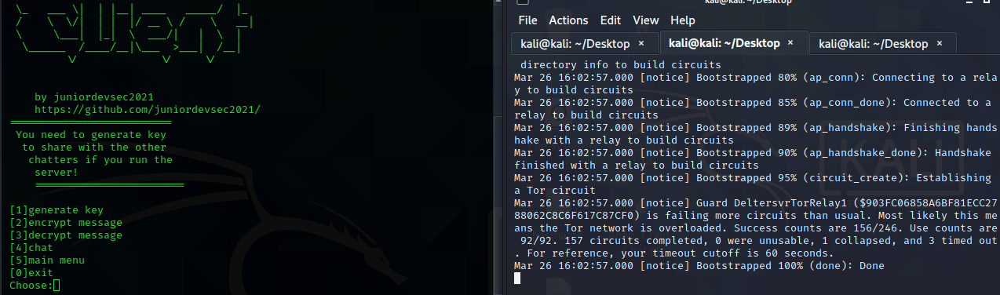
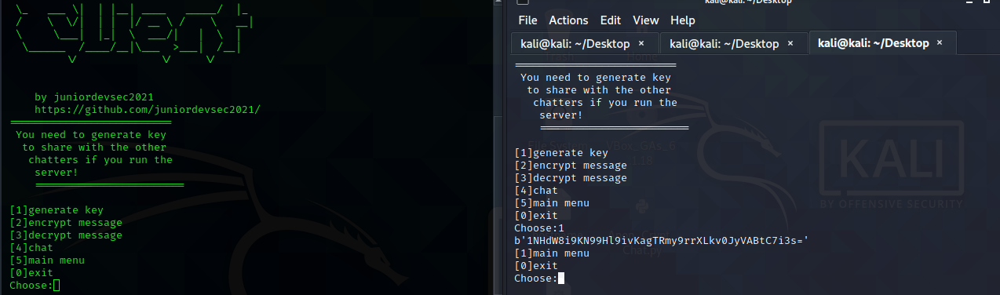
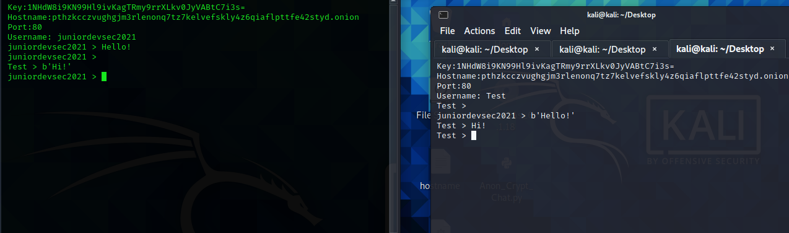
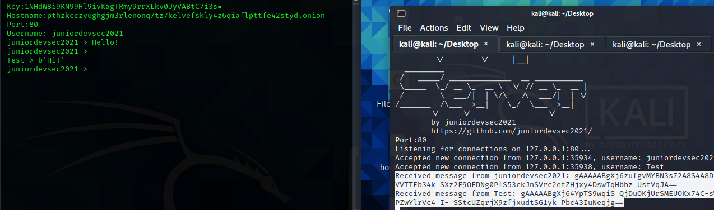

# chat
Anonymous Encrypted Chat over TOR network
* The program is for linux/ubuntu distros.
* The requieremnts are:
*  tor service # sudo apt install tor
* python modules: pip install cython socks cryptography errno select
* run with command python3 Anon_Crypt_chat.py
* [1]create server (installs tor service and creates a hidden serice which will use for chat server)
* [2]load server (opens 3 tabs,1 - runs python server,2 - runs tor server,3 - the main menu from which we enter in the chat).
* [3]enter chat (enter in the chat when you are done with the server).
* 
* You can run the server on a remote host and connect with you and your friends from your hosts there is a separe server file.
* Only the chatters who have the key can decrypt and read the messages,for example if the server is on a remote host,the owner can't
* decrypt and see the messages.

### Do not use the program for any illegal activities!I'm not responsible for what you do!The choice is yours!
